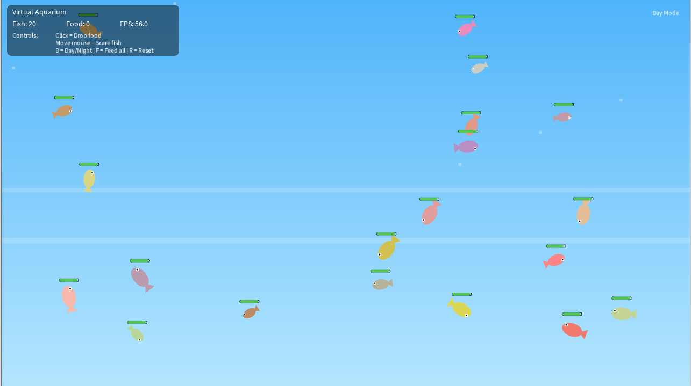

# 🐠 Virtual Aquarium with Fish Behaviour

This project is an interactive **virtual aquarium** built in **Processing (Java)**.  
It demonstrates object-oriented programming, real-time graphics, and autonomous fish behaviour that responds dynamically to user input.  
The simulation features animated fish, environmental lighting, and realistic motion physics to create a visually engaging digital aquarium experience.

---

## ✨ Features
- 15+ fish objects that wander naturally with random motion  
- Smooth wall avoidance to prevent fish from leaving the tank  
- Fish react to the **mouse cursor** (predator effect)  
- **Left-click** to drop food particles — fish detect and eat them  
- **Day/Night toggle** with animated ambient lighting  
- **Hunger system** that changes fish colour and swim speed  
- On-screen **UI** showing fish count, food count, FPS, and controls  

---

## ▶️ How to Run
1. Open the project folder in the **Processing IDE**.  
2. Run the main file: `Aquarium.pde`.  
3. Interact with the aquarium using your **mouse** and **keyboard**.

---

## 🕹️ Controls

| Action | Key / Input |
|--------|--------------|
| Drop food | Left click |
| Scare fish | Move mouse cursor |
| Toggle Day/Night | `D` |
| Feed all fish | `F` |
| Reset aquarium | `R` |

---

## 👥 Team Roles

| Member | Role |
|---------|------|
| **Timothy Lam** | Graphics, UI & Integration Lead |
| **Muhammad Idrees** | Interaction & Controls Lead |
| **Hasan Khan** | Behaviour & Animation Lead |

---

## 🗂️ Project Structure

| File | Description |
|------|--------------|
| `Aquarium.pde` | Main program loop, environment rendering, controls, and UI. |
| `fish.pde` | Contains both the `Fish` and `Food` classes handling all behaviour and rendering. |
| `screenshot.png` | Example output image of the aquarium. |

---

## 🖼️ Example Output

